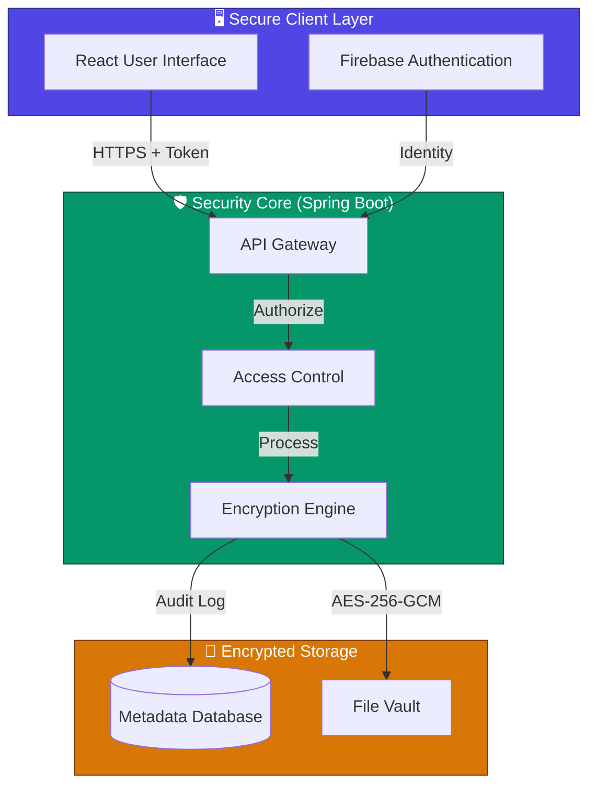

<p align="center">
  
</p>

<h1 align="center">Q-Vault</h1>

> **TL;DR**: A full-stack, security-first multimedia vault using AES-256-GCM, MFA, audit logging, and post-quantum-ready key protection — built with Java, Spring Boot, and React.

<p align="center">
  
  
  
  
  
  
</p>

<p align="center">
  <a href="#-project-overview">Overview</a> •
  <a href="#-key-features">Features</a> •
  <a href="#-system-architecture">Architecture</a> •
  <a href="#-security-standards">Security</a> •
  <a href="#-technology-stack">Tech Stack</a> •
  <a href="#-getting-started">Getting Started</a>
</p>

---

## 📋 Project Overview

**Q-Vault** is a multimedia security platform **designed using industry cryptographic best practices** to address the emerging threats of quantum computing. It provides a secure, encrypted vault for sensitive files, protecting them with **AES-256-GCM** encryption and **post-quantum key wrapping**.

Built for **security-sensitive applications**, Q-Vault ensures that data remains confidential, integral, and accessible only to authorized users through multi-factor authentication and rigorous audit logging.

### ⚠️ Clarification on Quantum Security

Q-Vault does **not** implement hardware-based Quantum Key Distribution (QKD).
Instead, it follows a **quantum-resilient cryptographic design** by using:

- **AES-256** (resistant to known quantum attacks such as Grover’s algorithm)
- **Post-quantum-ready key wrapping** (Kyber-compatible design)

This approach ensures long-term data security without requiring quantum hardware.

### 👥 Intended Audience
- Backend / Full-Stack Engineers
- Security Engineering Roles
- Cryptography & Privacy-focused Teams
- Academic & Research Demonstrations

---

## ✨ Key Features

<table>
<tr>
<td width="50%">

### 🔐 Advanced Security
*   **NIST-Recommended Encryption:** AES-256-GCM authenticated encryption for all files.
*   **Quantum Resilient:** Keys are wrapped using post-quantum algorithms.
*   **Multi-Factor Auth:** Login protected by Email OTP (2FA).
*   **Double-Lock Workspace:** Decrypted files protected by a secondary 6-digit PIN.

</td>
<td width="50%">

### 📁 Unified File Management
*   **Universal Support:** Encrypts Images, Videos, Audio, PDFs, and Archives.
*   **Large File Handling:** Stream-based processing supports files up to 10GB.
*   **Smart Categorization:** Automatically organizes files by media type.
*   **Secure Downloads:** On-the-fly decryption and verification.

</td>
</tr>
<tr>
<td width="50%">

### 🎨 Modern Experience
*   **Responsive UI:** Beautiful React interface with dark/light themes.
*   **Interactive Flow:** Real-time visibility into encryption processes.
*   **Visual Feedback:** Animated transitions and status indicators.

</td>
<td width="50%">

### 📊 Audit & Compliance
*   **Immutable Logs:** Every encryption/decryption event is recorded.
*   **Session Security:** Active session tracking and IP logging.
*   **Key Destruction:** Keys are wiped from memory immediately after use.

</td>
</tr>
</table>

---

## 🧠 Design Decisions & Trade-offs

- **AES-256-GCM** chosen for combined confidentiality + integrity (AEAD), preventing padding oracle attacks and tampering.
- **Firebase Auth** used instead of custom auth to reduce attack surface and leverage proven identity management.
- **H2 Database** selected for simplicity and zero-configuration development; easily replaceable with PostgreSQL for production.
- **Modular Monolith Architecture** chosen for faster development, type safety, and code clarity without the complexity of distributed systems.

---

## 🏗 System Architecture

The system follows a tiered layer architecture, separating the secure React frontend from the Spring Boot security core.



---

## 🔒 Security Standards

Q-Vault implements a defense-in-depth strategy:

### 🛡 Threat Model (STRIDE)

| Threat | Mitigation |
|------|-----------|
| **S**poofing | Firebase Auth + Email OTP (2FA) |
| **T**ampering | AES-256-GCM authenticated encryption |
| **R**epudiation | Immutable audit logs in database |
| **I**nformation Disclosure | No plaintext storage; Keys wrapped |
| **D**enial of Service | File size limits + stream processing |
| **E**levation of Privilege | Role-based access control (RBAC) |

### Encryption Specifications

| Component | Specification |
|-----------|---------------|
| **Algorithm** | **AES-256-GCM** (Authenticated Encryption) |
| **Key Strength** | **256-bit** (Quantum-resilient against known attacks) |
| **Integrity** | **128-bit** Authentication Tag |
| **Randomness** | Unique **96-bit IV** per file |

---

## 📡 Sample API Call

**Upload & Encrypt File**

```http
POST /api/files/upload
Authorization: Bearer <JWT>
Content-Type: multipart/form-data
```

**Response**

```json
{
  "fileId": "9f3c21-88a2-4b",
  "status": "ENCRYPTED",
  "algorithm": "AES-256-GCM",
  "iv": "8d7f...",
  "timestamp": "2024-12-26T10:00:00Z"
}
```

---

## 🛠 Technology Stack

| Domain | Tech Choice | Rationale |
|--------|-------------|-----------|
| **Frontend** | **React 18 + Vite** | High performance, component-based UI |
| **Backend** | **Spring Boot 3.2** | Enterprise-grade security and robustness |
| **Security** | **Spring Security** | Industry standard authentication flow |
| **Crypto** | **Bouncy Castle** | Professional cryptographic implementations |
| **Identity** | **Firebase Auth** | Secure, scalable identity management |
| **Database** | **H2 / JPA** | Reliable persistence with transaction safety |

---

## 🚀 Getting Started

The project includes automated scripts for instant deployment.

[**👉 Click here for the detailed Setup Guide**](SETUP.md)

### Quick Launch Steps:

1.  **Clone the Repository** to your local machine.
2.  **Configure Credentials** (Email & Firebase) as per the setup guide.
3.  **Run the Start Script**:
    > The included `start.sh` script handles dependencies, port checks, and starts both servers automatically.
4.  **Access the Dashboard** at `http://localhost:5173`.

---

## � Limitations & Future Improvements

- **H2 Database** used for development simplicity; production deployment would use PostgreSQL.
- **Post-quantum wrapping** is design-ready; full NIST Kyber integration planned.
- Currently optimized for **single-user vaults**; multi-tenant support is a roadmap item.

---

## �🤝 Contributing

We welcome professional contributions. Please fork the repository and submit a Pull Request following standard Git flow practices.

---

## 📄 License

This project is licensed under the **MIT License**.

---

<p align="center">
  <br>
  <strong>Built with 💜 for a Secure Future</strong>
  <br><br>
  
</p>
